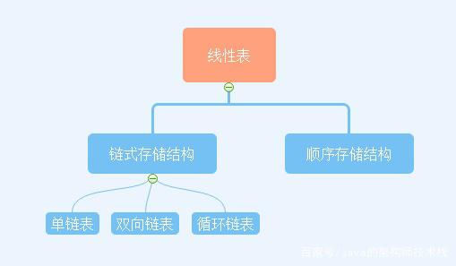
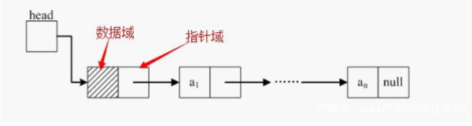
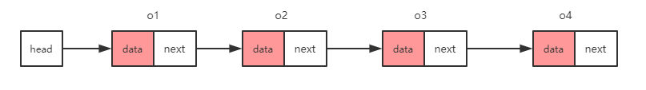
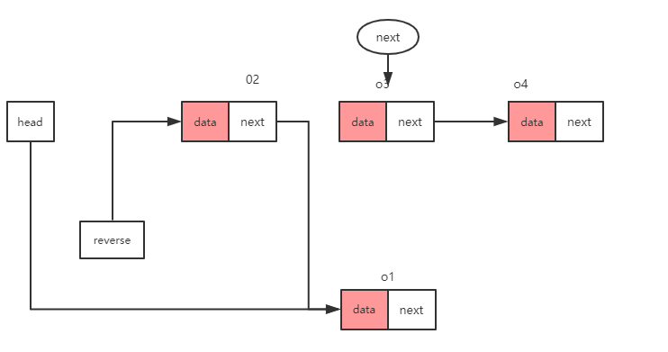

# 数据结构和算法笔记

## 1. 线性结构：
### 1.2特点：
元素之间存在一对一的线性关系
### 1.3存储结构：
顺序存储结构和线性存储结构，顺序存储的线性表称为==顺序表==，顺序表中的存储元素是连续的。链式存储的线性表成为==链表==，链表中存储的元素不一定是连续的，元素节点中存放数据元素以及相邻元素的地址信息。
常见的线性结构：
数组、队列、链表、栈
非线性结构：
二维数组、多维数组、广义表、树结构、图结构

## 2.稀疏数组

当一个数组中大部分为0，或者为同一个值的数组时，可以使用稀疏数组来保持该数组。
### 2.1 稀疏数组的处理方法
1. 第一行记录数组一共有几行几列，有多少个不同值。
2. 把具有不同值的元素的行列及值记录在一个小规模数组中，从而缩小程序的规模。
### 2.2应用实例  
1. 使用稀疏数组来保存类似前面的二位数组（棋盘，地图等）
2. 把稀疏数组存盘，并可以从新恢复原来的二维数组
    

#### 2.3 问题分析
二位数组有很多默认值0，因此记录了很多没有意义的数据 => 改用稀疏数组存储

```
     [二维数组]                          [稀疏数组]    
 0 0 0 0 0 0 0 0 0 0 0                  11  11  2
 0 0 1 0 0 0 0 0 0 0 0     =>           1   2   1
 0 0 0 2 0 0 0 0 0 0 0     =>           2   3   2
 0 0 0 0 0 0 0 0 0 0 0     =>			
 0 0 0 0 0 0 0 0 0 0 0               
 0 0 0 0 0 0 0 0 0 0 0     			 
 0 0 0 0 0 0 0 0 0 0 0    		 
 0 0 0 0 0 0 0 0 0 0 0
 0 0 0 0 0 0 0 0 0 0 0
 0 0 0 0 0 0 0 0 0 0 0
 0 0 0 0 0 0 0 0 0 0 0
```

|  行  |  列  |  值  | 说明                                   |
| :--: | :--: | :--: | :------------------------------------- |
|  11  |  11  |  2   | 原始数组信息：原始数组是11行11列的数组 |
|  1   |  2   |  1   | 原始数据中第二行地三列的值为1          |
|  2   |  3   |  2   | 原始数组中第三行第四列为2              |


#### 2.3.1解决思路
##### 2.3.2 原始数组转稀疏数组
遍历原始数组得到有效数据的个数sum
根据有效数据的个数得到稀疏数组sparseArr[sum+1][3]
##### 2.3.3稀疏数组转原始数组
根据稀疏数组的第一行创建原始数组，比如上面的chessArr[11][11]
遍历稀疏数组第二行以后的行赋值给原始数组

##### 2.3.4 代码

```java
/**
 * 1-表示黑子，2-表示蓝子
 */
public class SparseArr {
    public static void main(String[] args) {
        // 1.创建11*11数组
        int[][] chessArr = new int[11][11];
        // 2.表示出第二行第三列的白子,第三行第四列的黑子
        chessArr[1][2] = 1;
        chessArr[2][3] = 2;
        //打印出原始数组
        System.out.println("=================【原始数组】================");
        for (int i = 0; i < chessArr.length; i++) {
            for (int j = 0; j < chessArr[0].length; j++) {
                System.out.print(chessArr[i][j]+"\t");
            }
            System.out.println();
        }
        // 将原始数组转为稀疏数组
        // 1.遍历原始数组
        // sum：有效数值个数
        int sum = 0;
        for (int i = 0; i < chessArr.length; i++) {
            for (int j = 0; j < chessArr[0].length; j++) {
                if (chessArr[i][j] != 0) {
                    sum++;
                }
            }
        }
        // 2.得到数组个数建立稀疏数组
        // 稀疏数组的第一行为原始数组信息所以稀疏数组行数为sum+1
        // 稀疏数组的列数固定为三列
        int[][] sparse = new int[sum + 1][3];
        // 3.第一行数据赋值
        //原始数组的行数
        sparse[0][0] = chessArr.length;
        //原始数组的列数
        sparse[0][1] = chessArr[0].length;
        //有效数值的个数
        sparse[0][2] = sum;

        // 稀疏数组的行数
        int row = 0;
        for (int i = 0; i < chessArr.length; i++) {
            for (int j = 0; j < chessArr[0].length; j++) {
                if (chessArr[i][j] != 0) {
                    row++;
                    //原始数组有效数值的行号
                    sparse[row][0] = i;
                    //原始数组有效数值的列号
                    sparse[row][1] = j;
                    // 原始数组的有效值的值
                    sparse[row][2] = chessArr[i][j];
                }
            }
        }
        System.out.println("↓↓↓↓↓↓↓↓↓↓【原始数组转为稀疏数组】↓↓↓↓↓↓↓↓↓↓↓↓");
        // 打印稀疏数组
        for (int i = 0; i < 3; i++) {
            for (int j = 0; j <sparse[0].length ; j++) {
                System.out.print(sparse[i][j]+"\t");
            }
            System.out.println();
        }

        //=======================【稀疏数组转为原始数组】==========================
        
        // 1.根据原始数组的第一行创建数组
        int[][] chessArr2 = new int[sparse[0][0]][sparse[0][1]];
        // 2 遍历原有效值的个数填充原始数组
        // 第一行为原始数组的信息所以从第二行开始遍历
        for (int i = 1; i <= sparse[0][2]; i++) {
            // 将第i个有效数值赋值给原始数组
            // sparse[i][0]-是原始数组的行数 sparse[i][1]-是原始数组的列数 sparse[i][2]-原始数组的有效值
            chessArr2[sparse[i][0]][sparse[i][1]] = sparse[i][2];
        }
        System.out.println("↓↓↓↓↓↓↓↓↓↓【稀疏数组转换为原始数组】↓↓↓↓↓↓↓↓↓↓");
        for (int i = 0; i < chessArr2.length; i++) {
            for (int j = 0; j < chessArr2[0].length; j++) {
                System.out.print(chessArr2[i][j]+"\t");
            }
            System.out.println();
        }

    }
}

```

## 3 队列
## 3.1 介绍
1. 队列是一个**有序列表**，可以用**数组**和**链表**实现

2. 遵循先入先出原则。

   

## 3.2队列的实现

### 3.2.1数组模拟队列

1. maxSize：队列的最大容量。

2. front：队列的头部索引,随着数据的输出而改变。

3. rear：队列的尾部索引随着数据的输入而改变。

   

#### a) 模拟单向队列

##### 思路分析

1. 数组为空：front == rear
2. 数据加入队中：rear +1
3. 数据存满：rear == maxSize-1(最大下坐标)  

##### 代码实现

###### 初始化

因为数组下标是从0开始，所以队列初始化时front和rear == -1 表示空。

front == 0 表示第一个元素。


```java
public class ArrQueueDemo {
    private int[] array;
    // 最大容量
    private int maxSize;
    //队列头位置
    private int front;
    //队列尾位置
    private int rear;

    // 初始化数组
    public ArrQueueDemo(int maxSize) {
        this.maxSize = maxSize;
        this.front = -1;
        this.rear = -1;
        array = new int[maxSize];
    }
    
    // 判断队列为空：front = rear
    public boolean isEmpty() {
        return front == rear;
    }

    // 判断是否已经满rear 等于最大索引
    public boolean isFull() {
        return rear == maxSize - 1;
    }


}
```

###### 添加


```java
   // 添加值
    public void add(int num) {
        //1.先判断数组是否已经满
        boolean full = isFull();
        if (full) {
            throw new RuntimeException("数组已经满了");
        }
        array[++rear] = num;
    }
```


###### 取值


```java
    // 取出值
    public int get() {
        // 1.先判断数组是否为空
        if (isEmpty()) {
            throw new RuntimeException("数组为空");
        }
        front++;
        return array[front];
    }
```

###### code

```java
import java.security.PrivateKey;

public class ArrQueueDemo {
    private int[] array;
    // 最大容量
    private int maxSize;
    //队列头位置
    private int front;
    //队列尾位置
    private int rear;

    // 初始化数组
    public ArrQueueDemo(int maxSize) {
        this.maxSize = maxSize;
        this.front = -1;
        this.rear = -1;
        array = new int[maxSize];
    }


    // 添加值
    public void add(int num) {
        //1.先判断数组是否已经满
        boolean full = isFull();
        if (full) {
            throw new RuntimeException("数组已经满了");
        }
        array[++rear] = num;
    }

    // 取出值
    public int get() {
        // 1.先判断数组是否为空
        if (isEmpty()) {
            throw new RuntimeException("数组为空");
        }
        front++;
        return array[front];
    }

    // 判断队列为空：front = rear
    public boolean isEmpty() {
        return front == rear;
    }

    // 判断是否已经满rear 等于最大索引
    public boolean isFull() {
        return rear == maxSize - 1;
    }

    public void show() {
        for (int i = front + 1; i <= rear; i++) {
            System.out.print(array[i] + " ");
        }
        System.out.println();
    }

    public static void main(String[] args) {
        ArrQueueDemo arrQueueDemo = new ArrQueueDemo(3);
        System.out.println("加入第一个值");
        arrQueueDemo.add(1);
        arrQueueDemo.show();
        System.out.println("加入第二个值");
        arrQueueDemo.add(2);
        arrQueueDemo.show();
        System.out.println("加入第三个值");
        arrQueueDemo.add(3);
        arrQueueDemo.show();

        System.out.println("取出第一个值" + arrQueueDemo.get());
        arrQueueDemo.show();
        System.out.println("取出第二个值" + arrQueueDemo.get());
        arrQueueDemo.show();
        System.out.println("取出第三个值" + arrQueueDemo.get());
        arrQueueDemo.show();
    }
}

```

##### b）环形数组

1. 环形队列中用初始化时front = 0 ，rear = 0

2. 单向队列中rear从maxSize - 1的最大索引移动到 0位置就形成了环形队列

3. 因为时环形队列不断重复用数组。所以rear值会超出maxSize，rear映射到数组的角标需要经过转化。

4. rear % maxSize，front % maxSize 是数组的真正尾部角标。

5. (rear + 1 % maxSize ) = front 表示队列已满。此时数组留出了一个空余空间。

6. front = rear 表示队列为空

7. 画一个圆形数组分分 分情况讨论可以得到上面的公式。

   


###### 代码实现

```java
public class CircleQueue {
    private int[] array;
    // 最大容量
    private int maxSize;
    //队列头位置
    private int front;
    //队列尾位置
    private int rear;

    public CircleQueue(int maxSize) {
        this.maxSize = maxSize;
        array = new int[maxSize];
        front = 0;
        rear = 0;
    }


    public boolean isEmpty() {
        return front == rear;
    }

    public boolean isFull() {
        return (rear + 1) % maxSize == front;
    }

    public void add( int num) {
        if (isFull()) {
            throw new RuntimeException("队列已经满了");
        }
        array[rear % maxSize] = num;
        rear++;
    }

    public int get() {
        if (isEmpty()) {
            throw new RuntimeException("队列为空");
        }
        return array[front++ % maxSize];
    }

    public void show() {
        for (int i = 0; i < rear ; i++) {
            System.out.print(array[i] + " ");
        }
    }

    public static void main(String[] args) {
        CircleQueue circleQueue = new CircleQueue(5);
        circleQueue.add(1);
        circleQueue.add(2);
        circleQueue.add(3);
        circleQueue.add(4);
        circleQueue.show();
        // 取出队列
        System.out.println();
        System.out.println("======================");
        System.out.println( circleQueue.get());
        System.out.println( circleQueue.get());
        System.out.println( circleQueue.get());
        System.out.println( circleQueue.get());
        System.out.println( circleQueue.get());
    }
}

```

## 3.3 链表

线性表根据存储结构可以分为顺序存储结构，和链式存储结构，**链表是链式存储结构的线性表**，链表的存储单元是连续的也可以是非连续的，因此为了表示当前数据元素与与直接后继元素的逻辑关系，对数据二元除了存储信息还要存储直接指示其后续节点的信息。




​																				     线性表

​		


​																						单链表逻辑结构

​							

### 3.3.1 单链表



​																单链表的逻辑结构图

##### 特点

1. 单链表每个节点出来有数据信息外还有下一个节点的位置信息。
2. 头节点不存数据只起指示数据的头部位置。
3. 尾节点的数据下一个节点指示部分为空。

##### 节点代码

```java
    //节点
    class Node<T> {
        private T data;

        private Node next;

        public Node(T data, Node next) {
            this.data = data;
            this.next = next;
        }

        public Node(T data) {
            this.data = data;
        }

        public T getData() {
            return data;
        }

        public void setData(T data) {
            this.data = data;
        }

        public Node getNext() {
            return next;
        }

        public void setNext(Node next) {
            this.next = next;
        }
    }
```

##### 插入

```java
    public void add(T data) {
        Node currentNode = head;
        // 查找到最后一个节点，currentNode.next == null 说明下一个节点不存在，当前节点是最后一个节点
        while (currentNode.next != null) {
            currentNode = currentNode.next;
        }
        // 创建待添加的Node
        currentNode.next = new Node<T>(data);
    }
```

##### 反转

###### 分析 (假定链表长度为4)

1. 因为o1的next指针将断开与原链表的关联关系，因此需要通过临时next保存原链表的o2位置
2. 反转之前head的next指向o1,而o1反转之后o1的next指向head的next（此时o1.next = head.next应当为null,但head.next != null ）所以用临时头部节点做反转操作。
3. 反转之后原head节点的next节点没有做操作还依然指向o1,等到反转操作结束再重新赋值



​																					反转之前的逻辑图

###### 第一次反转


​														第一次反转之后的逻辑图


###### 第二次反转

1. 临时变量next记录执行第三次反转o3。
2. 第二次反转将 o2.next 指向了 第一步结束后reverse.next也就是o1对象，这样 o2的下一个节点就是o1节点
3. 将reverse(头节点)的next指向o2（第二次反转之后的第一个节点）。



​											第二次反转之后逻辑图


###### 第三次反转

1. 与第二次反转操作一致


​														第三次反转之后逻辑图

###### 第四次反转

1. 此时临时next变量为null。


###### 反转结束

1. 将临时头节点指向的o4赋值给原头节点head反转结束。


###### 全部代码

```java
public class SingleLinkedList<T> {
    private Node<T> head = new Node<>();

    public void add(T data) {
        Node currentNode = head;
        // 查找到最后一个节点，currentNode.next == null 说明下一个节点不存在，当前节点是最后一个节点
        while (currentNode.next != null) {
            currentNode = currentNode.next;
        }
        // 创建待添加的Node
        currentNode.next = new Node<T>(data);
    }

    public void print() {
        // head节点不包括在内
        Node currentNode = head.next;
        // 查找到最后一个节点.如果currentNode == null 说明节点不存在，循环结束
        while (currentNode != null) {
            System.out.print(currentNode.data);
            currentNode = currentNode.next;
        }
    }

    private void reverse() {
        // 临时头节点：原几点因为next已经指向了第一个节点避免之后错误，要新建一个临时的节点
        Node<T> reverseHead = new Node();
        Node<T> current = head.next;
        Node<T> nextNode = null;
        // 如果为空或者只有一个节点不需要反转
        if (head.next == null || head.next.next == null) {
            return;
        }
        // 循环完节点
        while (current != null) {
            // 保存下一个节点的位置，因为当前节点的next的节点要重新赋值
            nextNode = current.next;
            // 当前节点的next 节点始终指向第一个节点
            current.next = reverseHead.next;
            // 将当前节点标记为第一个节点
            reverseHead.next = current;
            // 实现反转之后，重复进行下一个节点反转
            current = nextNode;
        }
        //将reverseHead 赋值给原头节点
        head = reverseHead;
    }

    // 节点数据
    class Node<T> {
        private T data;

        private Node next;

        public Node(T data) {
            this.data = data;
        }

        public Node() {
        }

        public T getData() {
            return data;
        }

        public void setData(T data) {
            this.data = data;
        }

        public Node getNext() {
            return next;
        }

        public void setNext(Node next) {
            this.next = next;
        }
    }

    public static void main(String[] args) {
        SingleLinkedList<Integer> singleLinkedList = new SingleLinkedList<>();
        singleLinkedList.add(1);
        singleLinkedList.add(1);
        singleLinkedList.add(2);
        singleLinkedList.add(2);
        singleLinkedList.reverse();
        singleLinkedList.print();
    }
}

```

###### 总结

1. 遍历操作每个节点的next节点，导致当前节点与下一个节点之间的联系断开，需要一个临时的next保存下一个节点位置，以便下一次遍历。
2. 需要新的head保存反转节点的头信息。
3. 多画图容易加深理解

#### 3.3.2 双向链表

##### 单链表的问题

1. 单链表的查找方向只能是一个。
2. 单向链表不能自我删除，需要辅助节点

##### 双向链表

1. 可以向前查找也可以向后查找
2. 每个节点除了数据部分、next变量还有 pre变量（指向前一个节点）


双向链表比单向链表多一个pre变量。

双向链表的Node节点代码：

```java
   class Node {
        private Node next;

        private Node pre;

        private Integer data;

        public Node(Node next, Node pre, Integer data) {
            this.next = next;
            this.pre = pre;
            this.data = data;
        }

        private Node(Integer data) {
            this.data = data;
        }

        public Node() {
        }

        public Node getNext() {
            return next;
        }

        public void setNext(Node next) {
            this.next = next;
        }

        public Node getPre() {
            return pre;
        }

        public void setPre(Node pre) {
            this.pre = pre;
        }

        public Integer getData() {
            return data;
        }

        public void setData(Integer data) {
            this.data = data;
        }
    }
```

双向链表的增加删除方法和单链表类似

```java
public class DoubleLinkedList {
    private Node head = new Node();

    private Node rear;

    //添加
    public void add(Integer data) {
        Node current = head;
        //最后一个节点
        while (current.next != null) {
            current = current.next;
        }
        Node newNode = new Node(data);
        current.next = newNode;
        newNode.pre = current;
        rear = newNode;
    }

    // 顺序打印
    public void print() {
        Node current = head.next;
        while (current != null) {
            System.out.println(current.data);
            current = current.next;
        }
    }

    // 逆序打印
    public void reprint() {
        Node current = rear;
        while (current.pre != null) {
            System.out.println(current.data);
            current = current.pre;
        }
    }

    private void del(Integer data) {
        Node current = head.next;
        while (current != null) {
            // 需要删除的数据
            if (current.data == data) {
                //删除的是最后一个节点
                if (current.next == null) {
                    current.pre = null;
                } else{
                    Node pre = current.pre;
                    Node next = current.next;
                    pre.next = next;
                    next.pre = pre;
                }
            }
            current = current.next;
        }
    }
    public static void main(String[] args) {
        DoubleLinkedList doubleLinkedList = new DoubleLinkedList();
        doubleLinkedList.add(1);
        doubleLinkedList.add(2);
        doubleLinkedList.add(3);
        doubleLinkedList.add(4);
        System.out.println("顺序打印");
        doubleLinkedList.print();
        System.out.println("逆序打印");
        doubleLinkedList.reprint();
        System.out.println("打印最后一个数");
        System.out.println(doubleLinkedList.rear.data);
        System.out.println("删除链表节点:3");
        doubleLinkedList.del(3);
        doubleLinkedList.print();
    }

    class Node {
        private Node next;

        private Node pre;

        private Integer data;

        public Node(Node next, Node pre, Integer data) {
            this.next = next;
            this.pre = pre;
            this.data = data;
        }

        private Node(Integer data) {
            this.data = data;
        }

        public Node() {
        }

        public Node getNext() {
            return next;
        }

        public void setNext(Node next) {
            this.next = next;
        }

        public Node getPre() {
            return pre;
        }

        public void setPre(Node pre) {
            this.pre = pre;
        }

        public Integer getData() {
            return data;
        }

        public void setData(Integer data) {
            this.data = data;
        }
    }
}

```

