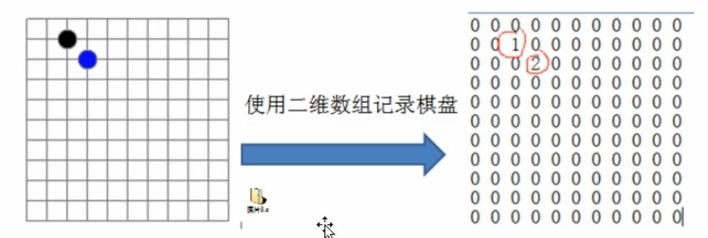

# 数据结构和算法笔记

## 1. 线性结构：
### 1.2特点：
元素之间存在一对一的线性关系
### 1.3存储结构：
顺序存储结构和线性存储结构，顺序存储的线性表称为==顺序表==，顺序表中的存储元素是连续的。链式存储的线性表成为==链表==，链表中存储的元素不一定是连续的，元素节点中存放数据元素以及相邻元素的地址信息。
常见的线性结构：
数组、队列、链表、栈
非线性结构：
二维数组、多维数组、广义表、树结构、图结构

## 2.稀疏数组

当一个数组中大部分为0，或者为同一个值的数组时，可以使用稀疏数组来保持该数组。
### 2.1 稀疏数组的处理方法
1. 第一行记录数组一共有几行几列，有多少个不同值。
2. 把具有不同值的元素的行列及值记录在一个小规模数组中，从而缩小程序的规模。
### 2.2应用实例
1. 使用稀疏数组来保存类似前面的二位数组（棋盘，地图等）
2. 把稀疏数组存盘，并可以从新恢复原来的二维数组
    

#### 2.3 问题分析
二位数组有很多默认值0，因此记录了很多没有意义的数据 => 改用稀疏数组存储

```
     [二维数组]                          [稀疏数组]    
 0 0 0 0 0 0 0 0 0 0 0                  11  11  2
 0 0 1 0 0 0 0 0 0 0 0     =>           1   2   1
 0 0 0 2 0 0 0 0 0 0 0     =>           2   3   2
 0 0 0 0 0 0 0 0 0 0 0     =>			
 0 0 0 0 0 0 0 0 0 0 0               
 0 0 0 0 0 0 0 0 0 0 0     			 
 0 0 0 0 0 0 0 0 0 0 0    		 
 0 0 0 0 0 0 0 0 0 0 0
 0 0 0 0 0 0 0 0 0 0 0
 0 0 0 0 0 0 0 0 0 0 0
 0 0 0 0 0 0 0 0 0 0 0
```

|  行  |  列  |  值  | 说明                                   |
| :--: | :--: | :--: | :------------------------------------- |
|  11  |  11  |  2   | 原始数组信息：原始数组是11行11列的数组 |
|  1   |  2   |  1   | 原始数据中第二行地三列的值为1          |
|  2   |  3   |  2   | 原始数组中第三行第四列为2              |


#### 2.3.1解决思路
##### 2.3.2 原始数组转稀疏数组
遍历原始数组得到有效数据的个数sum
根据有效数据的个数得到稀疏数组sparseArr[sum+1][3]
##### 2.3.3稀疏数组转原始数组
根据稀疏数组的第一行创建原始数组，比如上面的chessArr[11][11]
遍历稀疏数组第二行以后的行赋值给原始数组

##### 2.3.4 代码

```java
/**
 * 1-表示黑子，2-表示蓝子
 */
public class SparseArr {
    public static void main(String[] args) {
        // 1.创建11*11数组
        int[][] chessArr = new int[11][11];
        // 2.表示出第二行第三列的白子,第三行第四列的黑子
        chessArr[1][2] = 1;
        chessArr[2][3] = 2;
        //打印出原始数组
        System.out.println("=================【原始数组】================");
        for (int i = 0; i < chessArr.length; i++) {
            for (int j = 0; j < chessArr[0].length; j++) {
                System.out.print(chessArr[i][j]+"\t");
            }
            System.out.println();
        }
        // 将原始数组转为稀疏数组
        // 1.遍历原始数组
        // sum：有效数值个数
        int sum = 0;
        for (int i = 0; i < chessArr.length; i++) {
            for (int j = 0; j < chessArr[0].length; j++) {
                if (chessArr[i][j] != 0) {
                    sum++;
                }
            }
        }
        // 2.得到数组个数建立稀疏数组
        // 稀疏数组的第一行为原始数组信息所以稀疏数组行数为sum+1
        // 稀疏数组的列数固定为三列
        int[][] sparse = new int[sum + 1][3];
        // 3.第一行数据赋值
        //原始数组的行数
        sparse[0][0] = chessArr.length;
        //原始数组的列数
        sparse[0][1] = chessArr[0].length;
        //有效数值的个数
        sparse[0][2] = sum;

        // 稀疏数组的行数
        int row = 0;
        for (int i = 0; i < chessArr.length; i++) {
            for (int j = 0; j < chessArr[0].length; j++) {
                if (chessArr[i][j] != 0) {
                    row++;
                    //原始数组有效数值的行号
                    sparse[row][0] = i;
                    //原始数组有效数值的列号
                    sparse[row][1] = j;
                    // 原始数组的有效值的值
                    sparse[row][2] = chessArr[i][j];
                }
            }
        }
        System.out.println("↓↓↓↓↓↓↓↓↓↓【原始数组转为稀疏数组】↓↓↓↓↓↓↓↓↓↓↓↓");
        // 打印稀疏数组
        for (int i = 0; i < 3; i++) {
            for (int j = 0; j <sparse[0].length ; j++) {
                System.out.print(sparse[i][j]+"\t");
            }
            System.out.println();
        }

        //=======================【稀疏数组转为原始数组】==========================
        
        // 1.根据原始数组的第一行创建数组
        int[][] chessArr2 = new int[sparse[0][0]][sparse[0][1]];
        // 2 遍历原有效值的个数填充原始数组
        // 第一行为原始数组的信息所以从第二行开始遍历
        for (int i = 1; i <= sparse[0][2]; i++) {
            // 将第i个有效数值赋值给原始数组
            // sparse[i][0]-是原始数组的行数 sparse[i][1]-是原始数组的列数 sparse[i][2]-原始数组的有效值
            chessArr2[sparse[i][0]][sparse[i][1]] = sparse[i][2];
        }
        System.out.println("↓↓↓↓↓↓↓↓↓↓【稀疏数组转换为原始数组】↓↓↓↓↓↓↓↓↓↓");
        for (int i = 0; i < chessArr2.length; i++) {
            for (int j = 0; j < chessArr2[0].length; j++) {
                System.out.print(chessArr2[i][j]+"\t");
            }
            System.out.println();
        }

    }
}

```

## 3 队列
## 3.1 介绍
1. 队列是一个**有序列表**，可以用**数组**和**链表**实现

2. 遵循先入先出原则。

   

## 3.2队列的实现

### 3.2.1数组模拟队列的实现

1. maxSize：队列的最大容量。

2. front：队列的头部索引,随着数据的输出而改变。

3. rear：队列的尾部索引随着数据的输入而改变。

   

#### a) 数据存入队列

##### 思路分析

1. 数组为空：front == rear
2. 数据加入队中：rear +1
3. 数据存满：rear == maxSize-1(最大下坐标)  

##### 代码实现

###### 初始化

因为数组下标是从0开始，所以队列初始化时front和rear == -1 表示空。

front == 0 表示第一个元素。


```java
public class ArrQueueDemo {
    private int[] array;
    // 最大容量
    private int maxSize;
    //队列头位置
    private int front;
    //队列尾位置
    private int rear;

    // 初始化数组
    public ArrQueueDemo(int maxSize) {
        this.maxSize = maxSize;
        this.front = -1;
        this.rear = -1;
    }
    
    // 判断队列为空：front = rear
    public boolean isEmpty() {
        return front == rear;
    }

    // 判断是否已经满rear 等于最大索引
    public boolean isFull() {
        return rear == maxSize - 1;
    }


}
```

###### 添加


```java

```


###### 取值

